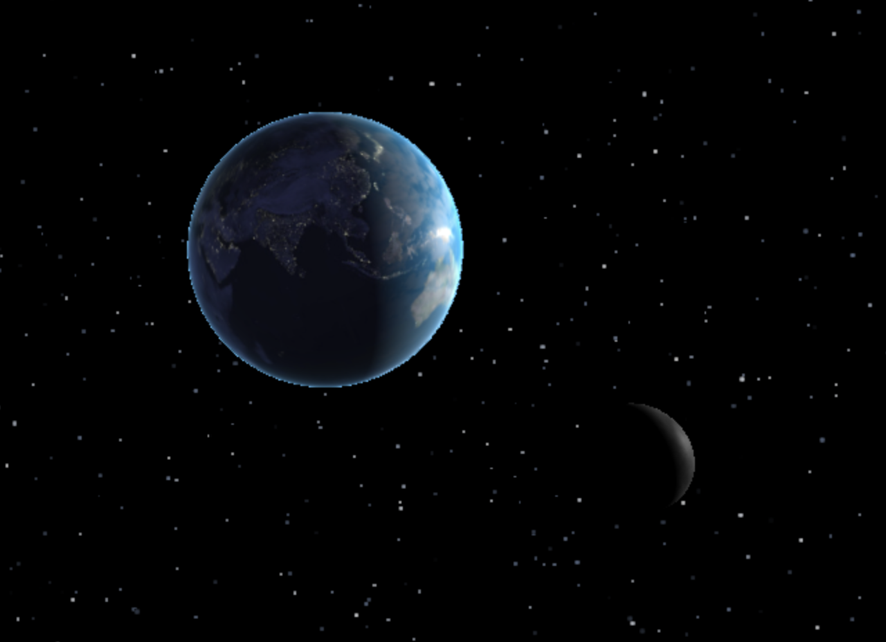

# Solar System Model
## using Three.js
****
A 3D model of our solar system that can be rendered on the browser. This includes the Sun, our 8 planets, and of course, couldn't leave out Pluto.

***
<h3>
  <ins>Earth</ins>
</h3>

I started with, perhaps the most detailed and complex planet, our Earth. Using Icosahedron Geometry with a detail of 12 (which would be used for all planets), I could mimic a sphere and start placing texture maps to resemble the Earth. To create depth and detail, I combined textures for the day and nighttime so that it looks like the cities are lit in the night. I also added a cloud texture that's scaled to be slightly greater than 1 and changed the rotation speed to be a little faster than the Earth's. The result is that the clouds look like they are independent from the planet. 

<h4>
  <ins>Moon</ins>
</h4>
An important part of the Earth's system is the moon that orbits it, so I have implemented a model of the moon similar to the Earth. 
Using some <a href = "./utilities/getOrbitalPosition.js"> orbital physics</a>, I implemented the orbiting mechanics of the moon around the earth.

<h3>
  <ins>Planets with Rings</ins>
</h3>

The next most interesting planets to be working on were Saturn and Uranus because of their distinctive ring structure. This was done using Ring Geometry and Phong material which could cast and receive shadows (basic for Uranus because rings aren't as distinct to receive shadows).

<h4>
  <ins>Saturn</ins>
</h4>

<h4>
  <ins>Uranus</ins>
</h4>

<h3>
  <ins>Final Model</ins>
</h3>

Here is the final model of the entire solar system after I finished implementing all the planets. Here is the code to create <a href = "./utilities/planetBuilders">each planet</a>

https://github.com/coolkidwrik/Solar_System/images/69946310/9592ac3d-bfbb-43d8-933e-24616d3f6763

